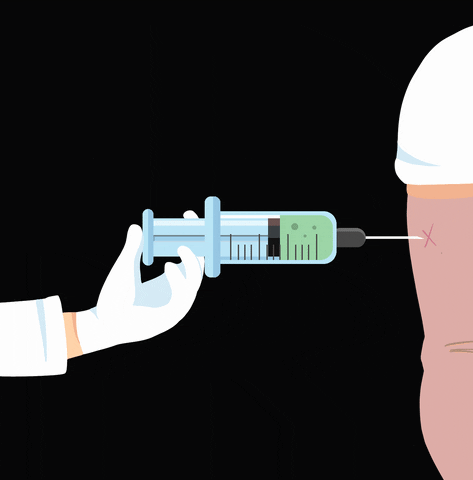

## El gran reto de este 2021

Hoy haré una excepción y hablaremos de uno de los temas más urgentes y del que todo el mundo está en expectativa.
Hasta el momento el proceso de vacunación en el Perú, que se dio inicio el 09 de febrero, viene siendo todo un éxito, ya con más de 50 mil peruanos vacunados en menos de una semana, pertenecientes al sector salud , por fín al parecer podemos comenzar a ver una luz de esperanza al final del túnel. Aunque esto es solo el inicio de uno de los retos nunca antes vistos en la historia del Perú.
Hay que tener en cuenta, que para poder poner en marcha una campaña masiva de vacunación para un mínimo de 22 millones de peruanos ( que es lo que se requiere para crear inmunidad colectiva) trae consigo muchos factores, que el gobierno actual y el próximo deberan coordinar a detalle, entre los principales estarian :

* La logística internacional.
* Distribución a lo largo del territorio.
* Almacenamiento adecuado para millones de dosis.
* Mantener la temperatura de estas.
* Control y manejo eficaz de los padrones y respetar las fases I, II, III. 
* Capacidad de personal preparado.

Estos son algunos puntos importantes, en el que no muchos candidatos estan pensando, cuando la mayoría de sus propuestas e ideas deberian estar focalizadas en estos temas y así poder asegurar el cumplimiento del **Plan Nacional de Vacunación** preparado por el MINSA [enlace](https://www.gob.pe/11796-plan-nacional-de-vacunacion-contra-la-covid-19).

Hasta el momento, cabe resaltar que el Perú ya tiene 23.1 millones de dosis aseguradas, estás han sido obtenidas a través de diferentes maneras, en realidad solo hay 3:

1. Compra directa con las farmacéuticas o laboratorios.
1. Adquisición a través de la Alianza ***Covax Facility***.
1. La participación del Perú en los diferentes ensayos clínicos.

En resumen, los acuerdos y compras se organizan de la siguiente forma: 1 millon de dosis en diferentes lotes por parte de Sinopharm, AstraZeneca con 14 millones, Pfitzer con 9.9 millones de dosis siendo una de las vacunas más efectivas con un 95% y finalmente con Covax Facility, que es un proyecto global puesto en marcha por la OMS y la fundación de Bill Gates, nos otorgarán 1 700 000 dosis, siendo el cuarto lote confirmado.

Con todo esto sumamos la cantidad para vacunar a más de 11 millones de peruanos, antes que acabe el mandato del Señor Don Quijote xd, lo cual no esta nada mal, ahora la chamba se debe centrar en agilizar las fechas de llegada y estar preparados para distribuir millones de dosis, sin ocasionar mermas y peor aún si las vacuans no son almacenadas en las condiciones optimas podrían perder su efectividad.

La primera fase se está dando gracias al apoyo de las empresas privadas y la sociedad civil, quienes han coordinado todo el tema logístico y la agilización de la llegada de estos primeros lotes. Pero en las siguientes fases el Estado es el que tiene toda la responsabilidad de suministrar estos farmacos a lo largo de nuestra dificil geografía peruana, manteniendo temperaturas de -70 grados en el caso de la vacuna de Pfitzer/BioNTech. Esperemos que más candidatos vayan pensando en diversas estrategias para poder hacer posible este gran reto. 

 

