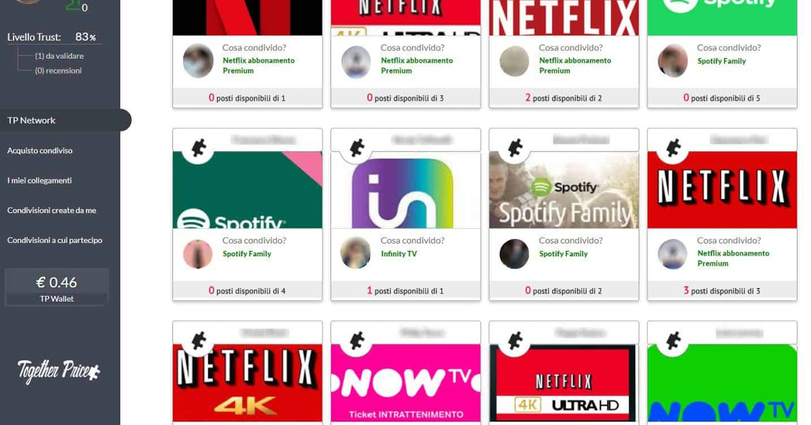

### Ahorrando dinero a través de Together Price

Debido a la gran demanda de servicios con planes multi-usuarios, especialmente de entretenimiento y ha eso sumado el cierre de cines y otros negocios relacionados a ello, muchos estamos optando en adquirir estos servicios premium.

Pero seria mucho mejor si podemos disfrutar de nuestras series, peliculas, videojuegos o música ahorrando hasta un 80% del valor real del servicio completo por el que pagamos. Aunque ya seguro te has percatado que mucha gente hace esto con sus familiares o amigos, pero el problema con esto es que a veces perdemos tiempo buscando con quien compartir nuestras cuentas, o cuando llega fin de mes y debemos estar cobrandoles a las personas 8 o 12 soles. 
Bueno la solución para automatizar estos procesos se llama __Together Price__.




### ¿Cómo funciona ? 🤔🤔

Bueno en resumen, [Together Price](https://www.togetherprice.com/es/) es un sistema de pago en grupo que te permite ahorrar hasta el 80% del coste de productos y servicios digitales multi-cuentas como te estaba comentando, algunas funcionalidades que ofrece la app son:

- Un chat privado para comunicarse con los miembros del grupo.
- Un Wallet digital donde reunir las cuotas de los miembros del grupo.
- Verifica que el admin haya facilitado las credenciales de acceso al servicio con TPassword.
- Una red de confianza basada en un nivel de fiabilidad que, gracias a verificaciones personales y comportamientos     dentro de la plataforma, es capaz de medir la credibilidad de un usuario.

Puedes convertirte en ***Admin*** o en ***participante***:
```js
var admin = "Si eres titular del servicio y buscas con quien compartirla"
var participante = "Si estas buscando unirte a un grupo"
```

### Algunos servicios que podrias compartir 👇

1. Spotify ( 6 cuentas )
1. HBO GO ( 2 dispositivos )
1. Netflix ( 4 perfiles )
1. Amazon Prime Video ( 3 dispositivos )
1. Disney Plus ( 4 dispositivos )
1. X box Live
1. Youtube Premiun
1. Movistar Plus
1. Office 365
1. Tidal
1. Deezer Premium

Entre muchos más 😉. Prueba la app por ti mismo, es completamente gratis: [Click aquí](https://www.togetherprice.com/es/)

