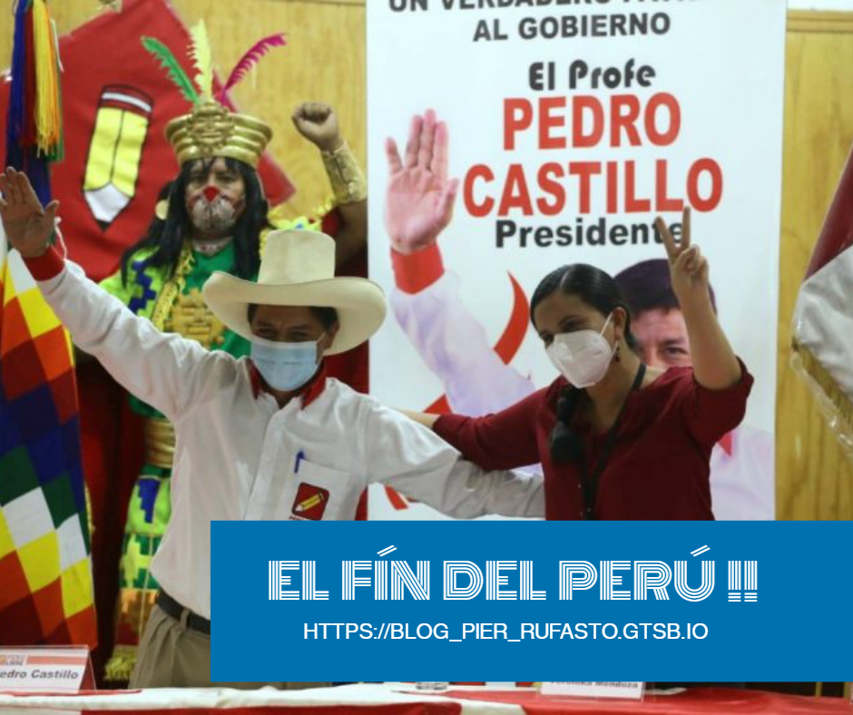

### La lucha aún no acaba...

Con estos últimos resultados electorales, hemos vuelto a retroceder 30 años, de los cuales parecen haber sido insuficientes para demostrar el desarrollo económico alcanzado (un 5% anual promedio). Que fue no percibido por las zonas rurales, del Perú profundo y de algunas otras minorías engañadas por la nueva izquierda (comunidades LGTB, feminismo ,etc). A eso sumarle la corrupción y a una serie de gobiernos que no representan la derecha liberal o el famoso neoliberalismo del que tanto hablan los grupos de izquierda cuando en realidad nunca sea practicado en nuestro país al 100%. Otro factor que benefició a los zurdos fue la pandemia.Con este escenario perfecto, los políticos de izquierda comenzaron a predicar con más fervor los viejos principios socialistas como la lucha de clases, el materialismo dialéctico, la denominada “ideología de género”, impulsando con ello el feminismo radical, el homosexualismo ideológico, el aborto como libre disposición del cuerpo y todo tipo de hábitos autodestructibles que solo generan odio, resentimiento y división de la población. Encontraron la forma de rebelión ante la tradición hetero-capitalista de Occidente.
Discursos y propuestas que promueven el colectivismo del cual siempre se sujeta la izquierda para poder llegar al poder, aún cuando la historia les ha demostrado la gran destrucción económica que pueden generar. Es por ello, que quiero comenzar a compartir las ideas de la libertad, aquellas que no nos enseñan ni en el colegio, ni en la universidad. Porque las instituciones públicas en realidad son centros de adoctrinamiento marxistas, del  Keynesianismo, del antifugimorismo, entre otras posturas a favor del Estado. 

No puedo quedarme quieto, sin hacer nada, viendo como van a destruir mi país y aquí no se si me equivoque, desde mi análisis y comprensión de la economía Pedro Castillo, Verónika Mendoza (principal aliado), y Pedro Francke (economista aliado), forman un gran equipo para imponer una serie de medidas que generarán más pobreza y hambre. Este último (__Francke__), que es nombrado en noticieros como el posible aliado que dará estabilidad al país frente a la mentalidad radical de Castillo y Cerrón, solo me causa gracia. Y ver lo poco de economía básica que hace falta difundir en el Perú, porque recordemos que Pedro Francke fue precisamente quien redactó el plan económico de Verónica Mendoza, que fue duramente criticado por el economista Javier Milie, principal defensor de la escuela austriaca y del libertarismo en Argentina. 
- *__Aquí el video con el análisis completo__*

- *__Aquí su reacción ante el plan asesino de Castillo__ :*

Como estudiante de Comercio, persigo la idea de una minimización del Estado, y que este solo se encargue de la seguridad y justicia (Minarquismo). Estoy en contra de ese Estado que le hace la vida imposible a los empresarios, asfixiandolos a través de regulaciones excesivas, impuestos y barreras arancelarias que sepultan toda posibilidad de emprendimiento. Estoy en contra de un Estado intervencionista y del Keynesianismo que distorsiona el mercado. Debemos comenzar a compartir ese mensaje, en base a datos y hechos en donde por superioridad gana la derecha liberal.Porque somos mejores en lo productivo, en lo moral e incluso en lo estético.
En conclusión, con todo lo que se nos viene, mi consejo es, que en la medida de tus posibilidades ahorres todo lo que puedas, porque claramente en los próximos años si se aplican las propuestas de estos señores, el ambiente para hacer negocios quedará destruido. Por ello te invito a que sigas investigando, aprendiendo y así puedas tener la capacidad de críticar, he aquí te dejo algunos cracks que te ayudarán a comprender mucho más las ideas de la libertad :

+ **Murray Rothbard** (principal representante de la escuela austriaca de economía)
+ **Friedrich Hayek** (Ganador del premio Nobel en 1974)
+ **Ludwig Von Mises** (Gran crítico del socialismo, en su obra "El socialismo: un análisis económico y sociológico)
+ **Milton Friedman** (Representante del escuela de Chicago y defensor del libre mercado)
+ **Alex Kaiser** (abogado, profesor universitario, analista político y escritor chileno)
+ **Gloria Álvarez** (Politóloga y escritora guatemalteca, ha realizado giras de conferencias por América Latina en contra del populismo)
+ **Agustín Laje** (Es un escritor, politólogo y conferencista argentino)

> ##### Y por su puesto Amanecer Libertario :
> - Es un canal de youtube de un amigo llamado Mirko que desde hace casi 2 años viene promoviendo las ideas de la libertad en el Perú .
> #### VIVA LA LIBERTAD CARAJO!

